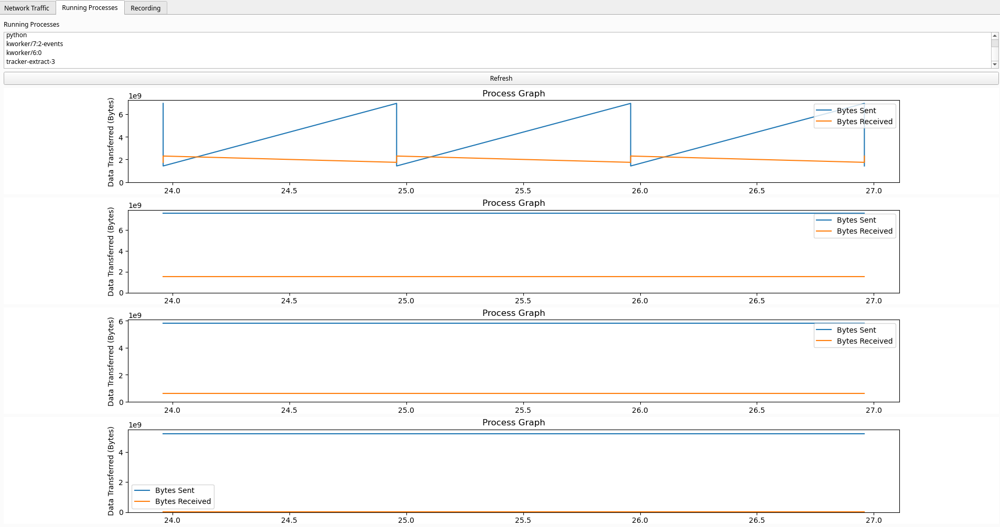

# Network Monitor

Network Monitor is a desktop application that allows users to monitor their network usage in real time. It provides detailed insights into the overall network activity, as well as per-process network usage.

## Features

1. **Real-time Network Monitoring:** Monitor total network activity in real time with live-updating graphs.

2. **Per-Process Network Monitoring:** Get detailed insights on network usage by individual processes.

3. **Recording:** Record network activity over time for later analysis.

## Screenshots

Here's what the application looks like in action:

### Overall Traffic Tab

This tab shows the overall network traffic:


### Process Graph Tab

This tab shows the network usage per process:



### Recording Tab

This tab allows you to record the network usage for later reference:


## Installation

To install the Network Monitor, clone this repository and install the required Python dependencies:

```bash
git clone https://github.com/mmrmagno/local-traffic-monitor.git
```
```bash
cd local-traffic-monitor
```
```bash
pip install -r requirements.txt
```
To start the Network Monitor, navigate to the project directory and run:

```bash
python main.py
```
